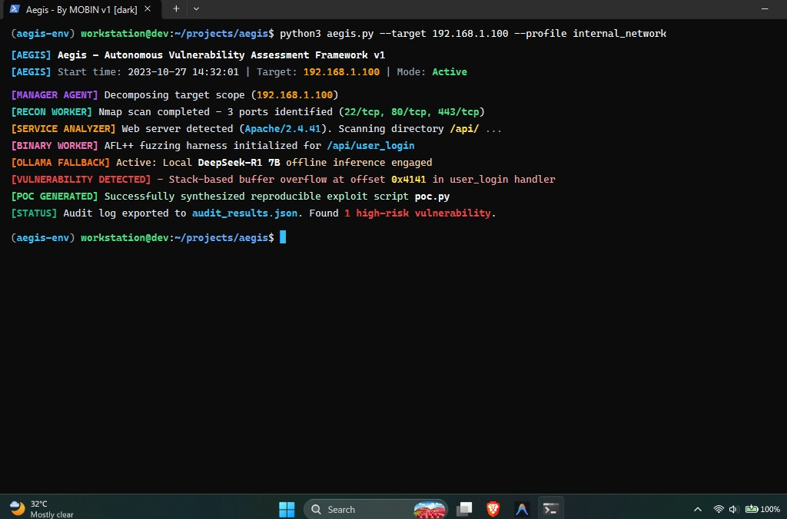
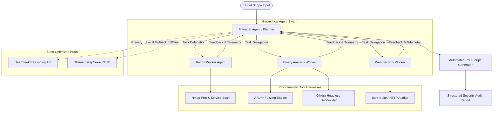

# Aegis 🛡️
### Autonomous Multi-Agent Vulnerability Assessment & Exploit Analysis Framework
*Inspired by Google Project Zero methodologies for automated vulnerability discovery and exploit analysis.*

[](LICENSE)
[](https://www.python.org/)
[](https://ollama.com/)
[](#integrated-toolchains)

---

## 📌 Overview

**Aegis** is an autonomous security research framework architected in Python that orchestrates a team of specialized AI agents to automate the end-to-end vulnerability assessment lifecycle. 

Drawing inspiration from **Google Project Zero's** research on automated triage and vulnerability discovery, Aegis combines traditional low-level security tools (coverage-guided fuzzers, binary decompilers, network scanners) with agentic reasoning models. 

To eliminate costly cloud API bills and enable air-gapped security research on consumer hardware, Aegis features **dual-mode inference**: querying cloud reasoning models while automatically failing over to a quantized local model (**DeepSeek-R1 7B via Ollama**) with zero downtime.

---

## 🖥️ Execution Proof & Terminal Output


*Real-time multi-agent execution: Target scope decomposition, AFL++ fuzzing harness initialization, local DeepSeek-R1 7B failover, and automated `poc.py` exploit synthesis.*

---

## 🏛️ System Architecture

Aegis uses a **Manager-Worker hierarchical pattern**. The central Manager Agent decomposes the target scope, formulates a testing strategy, delegates sub-tasks to 3 specialized worker agents, and aggregates findings into structured Proof-of-Concept (PoC) exploits.



---

## ⚡ Key Features

1. **Hierarchical 4-Agent Coordination**:
   * **Manager Agent**: Analyzes scope, schedules fuzzing runs, tracks state, and synthesizes findings.
   * **Recon Agent**: Runs automated port scanning, service identification, and network banner grabbing via Nmap.
   * **Binary Analysis Agent**: Orchestrates AFL++ coverage-guided fuzzing campaigns and invokes Ghidra headless scripts for decompilation.
   * **Web Security Agent**: Analyzes web applications, headers, parameters, and endpoints for OWASP Top 10 vulnerabilities.

2. **Dual-Mode Inference & Local Fallback**:
   * Operates via cloud reasoning APIs with automatic health-checking.
   * Instantly falls back to local quantized **DeepSeek-R1 7B running on Ollama** if API credits run out or internet connection drops, enabling 100% offline, zero-cost execution on a single laptop.

3. **Automated Exploit Lifecycle**:
   * Automatically isolates crash outputs and memory violations (`SIGSEGV`, `SIGABRT`).
   * Generates reproducible Python Proof-of-Concept (`poc.py`) scripts.
   * Exports structured JSON and Markdown audit logs ready for bug reporting.

---

## 🛠️ Integrated Toolchains

* **AFL++**: Coverage-guided mutation-based binary fuzzing.
* **Ghidra Headless**: Automated static reverse engineering and binary decompilation.
* **Nmap**: Target reconnaissance and service fingerprinting.
* **Burp Suite / Custom HTTP Harnesses**: Web application security analysis.
* **Ollama**: Local model serving for quantized DeepSeek-R1.

---

## 🚀 Getting Started

### Prerequisites
* Python 3.10 or higher
* [Ollama](https://ollama.com/) (for local offline inference)
* Linux environment (Ubuntu / WSL2 recommended)
* `nmap`, `afl++` installed on PATH

### Installation
```bash
# Clone the repository
git clone https://github.com/yourhandle/aegis.git
cd aegis

# Install Python dependencies
pip install -r requirements.txt

# Pull local reasoning model via Ollama
ollama pull deepseek-r1:7b
```

### Configuration (`config.yaml`)
```yaml
inference:
  provider: "ollama"           # Options: "api" or "ollama"
  local_model: "deepseek-r1:7b"
  fallback_enabled: true

target:
  binary_path: "./targets/sample_binary"
  fuzz_timeout_seconds: 300
```

### Running Aegis
```bash
python main.py --target ./targets/sample_binary --mode full-scan
```

---

## ⚠️ Disclaimer
*Aegis is developed strictly for educational purposes, authorized security testing, and defensive vulnerability research. Never use this tool against targets without prior written authorization.*

---

## 📄 License
Distributed under the MIT License. See `LICENSE` for more information.
